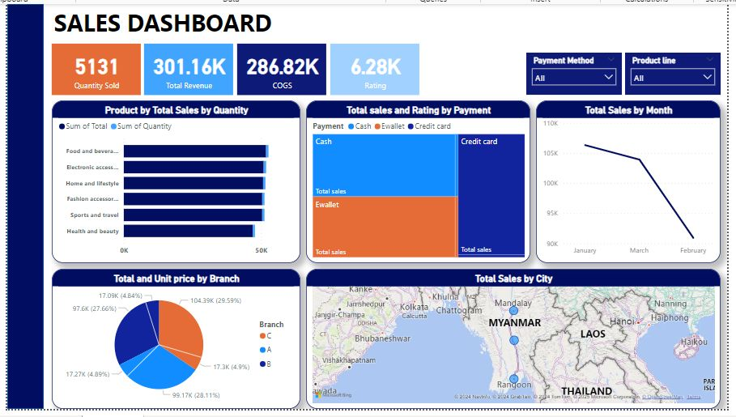
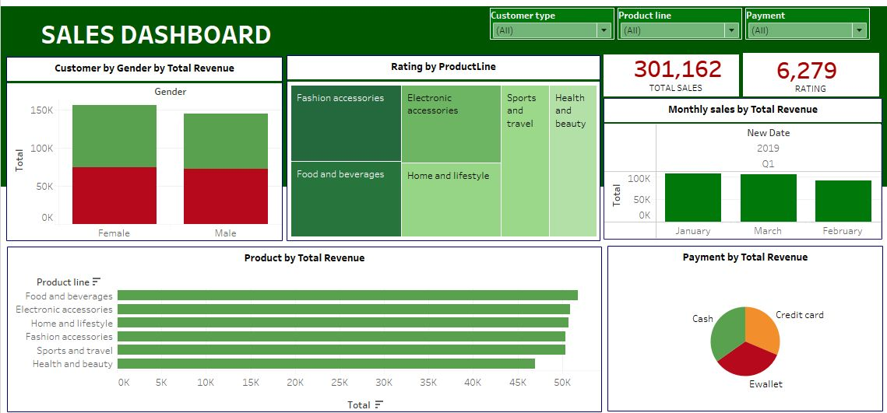
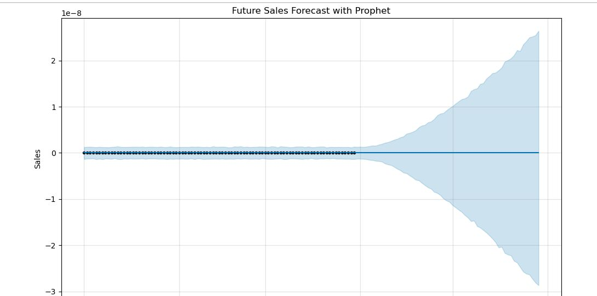

# Sales_Analysis-and-Forecasting
This project aims to analyze and forecast sales data to uncover trends, customer behaviors, and product performance.

  
## Introduction

Sales analysis and forecasting are essential for understanding business performance and driving strategic decisions. This report provides a comprehensive overview of sales data, focusing on uncovering trends, customer behaviors, and product performance. By leveraging advanced analytics and visualization tools like SQL, Tableau, and Power BI, the report identifies key insights that can inform marketing strategies, inventory management, customer engagement, and overall revenue optimization.

## Problem statement

1. What is the highest performing month?
2. What product line has the highest revenue and profit?
3. Which customer type and gender has the highest purchasing power?
4. Which location has the highest revenue generated?
5. What is the most preferred payment type?
6. Which product line has the highest and lowest rating?

  
## Data
The data contains various columns such as Invoice ID, Branch, City, Customer_type, Gender, Product_line, Unit_price, Quantity, Tax_5%, Total, cogs, gross_margin_percentage, gross_income, Date, Time, Payment, and Rating.

The dataset includes:
- **Transaction Details**: Invoice ID, Branch, City, Customer_type, Gender, Product_line, Date, and Time.
- **Financials**: Unit_price, Quantity, Tax, Total, Cost of Goods Sold (cogs), gross_margin_percentage, gross_income.
- **Customer Feedback**: Payment method and Rating.

*You can access the dataset [here](https://github.com/kouatcheu1/Sales_Analysis-and-Forecasting/blob/main/cleaned_sales_data.csv)*

## Skills demonstrated
- **SQL**: Data extraction, transformation, and cleaning.
- **Tableau**: Visualizing sales trends and customer behavior.
- **Python (Prophet)**: Forecasting future sales trends.

## Visualization

Data visualization was created using power bi and Tableau using different charts to highlight hidden insights from the data.

# Power BI Dashboard

  
**Features**:

  
1. Sales Revenue by Product by Quantity (Stacked Bar Chart)
- Explanation: The bar chart displays the total sales revenue and Quantity sold for each product category. This visualization makes it easy to compare the performance of different product categories at a glance. For example, it shows that "Food and beverages" has the highest sales revenue, followed by "Electronic Accessories" while "Health and Beauty." Had lowest total sales. Electronics accessories has highest quantity sold while health and beauty had lowest quantity sold. This insight helps identify which product lines are the most profitable and which may need further attention or marketing efforts.

2. Total sales and Rating by payment method (Tree Map chart)
- Explanation: The chart illustrates the sales and rating distribution between the three payment method (Cash, Ewallet, credit care), Cash had the highest sales and also the highest rating followed by Ewallet while Credit card had lowest sales and also lowest rating. 

3. Total and Unit price by Branch (Pie Chart)
- Explanation: The chart displays sales and unit price distribution across different Branch. Each branch is color-coded based on the total sales revenue. Branch “C” which is colored orange has the highest total revenue and also the highest unit price, followed by branch “B” while branch “A” had the lowest sales and lowest unit price.

4. Total sales by Month (Line Chart)
- Explanation: The visualizations shows the trend over time in the data, displaying total sales by month. January is the month with the highest sales, followed by March while February had the lowest total revenue.

5. Total sales by City (Map Visualization)
Explanation: The map chart shows the distribution of sales by the city.  Napityjaw had the highest sales, followed by Yangon while Mandaley had lowest sales.

6. Cards
Four cards were used to display the total sales, COGS, Rating and Quantity sold. Quantity sold is 5131, Total Sales is 301.16K, COGS is 286.82K while Rating is 6.28K.

7. Two slicer were used to filter the records.

_You can interact with the Power BI dashboard_ [here](https://app.powerbi.com/view?r=eyJrIjoiZGEwMDVlYzctOWFiOC00N2UzLTg1NjQtZjQ2NTE3Nzc3MDVkIiwidCI6ImJmZTU4MzM2LWNhYjktNGRlNS1iYTc1LThjZmY3ZTIyZWMyYyIsImMiOjN9)

# Tableau Dashboard

**Features**:
1.	Bar Chart: 
o	Shows seasonal patterns in sales, identifying high-demand months.
o	Displays total revenue per product line to understand product performance.

2.	Stacked Bar Chart: Highlights sales contributions by customer type and gender.

3.	Pie Chart: Shows preferences for payment methods like Cash, Credit Card, and Ewallet.

4.	Tree Map Chart: Visualizes customer ratings for each product line to gauge satisfaction.

5.	Slicers were added to the dashboard for filtering records and the data added are: Customer type, Product line and Payment type.

*You can access the tableau dashboard file [here](https://github.com/kouatcheu1/Sales_Analysis-and-Forecasting/blob/main/Tableau_Sales_Dashboard.twb)*

## Analysis 📉📈

# A. Using SQL to perform data extraction, transformation and preproessing. The following were performed using SQL:

**SQL Queries and Insights**
1.	Extract All Data: Allows a complete view of the data for subsequent analysis.
2.	Average Purchase by Customer Type and Gender: Shows behavioral differences between customer groups to tailor marketing and loyalty initiatives.
3.	Average Quantity by Product Line: Query to identify high-demand products by setting a threshold on average quantity.
4.	Branch and Rating Distribution: Enables identification of the branch with the highest customer satisfaction ratings.
5.	Identify Highest Unit Price by Product Line:	Query to determine the product line with the highest unit price.

- Data Transformation
1.	Date and Time Standardization:
o	Converted Date and Time columns into a unified timestamp format.
o	Outcome: Created a new column with standardized date-time data for consistent time-based analysis.

- Data Cleaning and Preprocessing
1.	Missing Values:
o	Checked for missing values in critical columns like Quantity, Unit_price, and Total.
o	Outcome: No missing values were found in key columns.
2.	Outliers in Rating:
o	Removed extreme ratings below 2 or above 9.5 to ensure data integrity.
o	Outcome: 71 outlier rows were removed.

*You can access the SQL scripts file [here](https://github.com/kouatcheu1/Sales_Analysis-and-Forecasting/blob/main/Sales_Analysis.sql)*

# B. Forecasting future sales using time-series analysis in Python

**Model: Prophet Model**

Using Prophet, sales was forecasted for 60 days. The model reveals a stable initial period, followed by a peak and drop, potentially due to seasonal demand or events. The script takes historical sales data, preprocesses it for forecasting, and generates predictions for future sales trends.

# Components:
- Historical Data (black dots): Actual sales from January to March 2019.
- Forecasted Sales (blue line): Predicted sales for April to May 2019.
- Confidence Interval: Range of uncertainty around forecasted sales.

**Chart Interpetation**
Sales Trend: Predicted stable sales initially, followed by a spike and sharp drop, possibly due to seasonal or one-time events

*In Conclusion
The overall pattern indicates an initial steady sales trend, followed by a significant upward spike in sales, peaking, and then a sharp drop. This could represent a seasonal effect, a campaign, or a one-time event driving sales up before a decline.* ⏬

*You can access the file [here](https://github.com/kouatcheu1/Sales_Analysis-and-Forecasting/blob/main/Sales_Forecast.ipynb)*
  
## Summary

The project focused on analyzing and forecasting sales data to uncover critical trends, customer behaviors, and product performance while identifying opportunities for business growth. Leveraging SQL for data extraction and transformation, Tableau for visual insights, and Python (Prophet Model) for sales forecasting, the project delivered actionable insights into sales trends, product demand, and customer satisfaction. Key analyses included customer demographics, branch performance, payment preferences, and product-line revenue contributions. 

## Conclusions

  
- **Sales Analysis**: The project identified seasonal sales patterns, with January being the peak month and February the lowest-performing. High-demand product lines such as Food and Beverages drive revenue, while Fashion Accessories exhibit higher customer satisfaction.
- **Customer Behavior**: Female members contribute significantly to revenue, and cash remains the dominant payment method.
- **Forecasting Accuracy**: The Prophet model provided reliable short-term sales forecasts, predicting a stable trend with occasional spikes.

## Recommendations

  
1. **Sales and Marketing**:
- Increase marketing efforts during high-demand months, particularly January, to capitalize on seasonal sales trends.
- Focus on promoting profitable product lines like Food and Beverages while strategizing improvements for lower-margin items.
- Target marketing campaigns toward high-revenue demographics, such as female members.

2. **Customer Satisfaction and Service**:
- Improve product quality for underperforming categories such as Health and Beauty to boost customer satisfaction.
- Introduce loyalty programs to encourage Normal customers to become Members, driving repeat purchases.

3. **Branch Performance and Expansion**:
- Expand operations in high-performing cities to capitalize on local market potential.
- Enhance customer experience at lower-rated branches to ensure consistent service quality.

4. **Payment Strategies**:
- Promote digital payment options through discounts or incentives to diversify payment methods and streamline transactions.

5. **Employee Development**:
- Conduct regular satisfaction surveys to monitor workforce engagement and address emerging concerns.
- Offer competitive compensation packages to retain top talent and improve employee satisfaction.
- Foster a culture of continuous learning through professional development programs to enhance skillsets and career growth.

*By implementing these recommendations, the organization can optimize revenue, enhance customer satisfaction, and improve workforce efficiency, ensuring sustained growth and profitability.* 🙂

